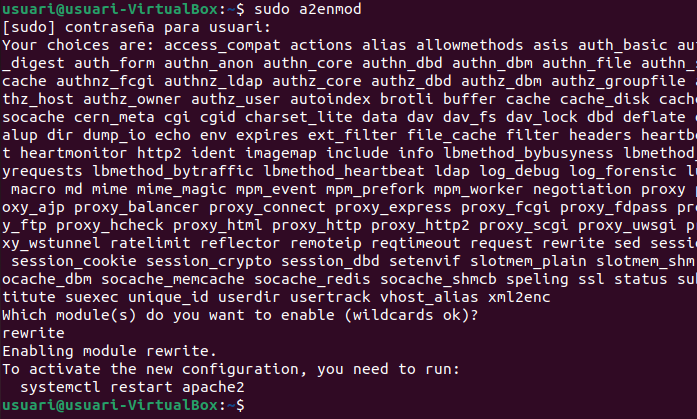

1. Añade en tu servidor el módulo mod_info y explique para que se utiliza este plugin.
 - Primero de todo ejecutamos el comando ls /usr/lib/apache2/modules/, para observar los modulos disponibles en apache2.

   

 - Luego con el comando sudo a2enmod, indicamos el modulo que queremos instalar, en nuestro caso el info.

   

 - Con systemctl restart apache2, reiniciamos el sistema apache para que se guarde la configuracion de modulos. Y para acabar con la funcion ls /etc/apache2/mods-enabled comprobamos que se haya instalado correctamente.
  
     

- El modulo info, nos da información de la configuración del servidor web apache, nos informa de los módulos y los archivos de configuración, incluidos los archivos por directorio.

2. Oculta la versión del sistema y sistema de apache.

 - Para ocultar la version del sistema y sistema de apache, editamos el archivo /etc/apache2/apache2.conf, y escribimos las lineas ServerSignature Off y ServerTokens Prod.
  
 - 

 -Con el comando sudo chmod orwx quitamos todos los permisos de visualizacion, escritura etc al archivo private.
    

3. Crea una carpeta en la raíz del path del servidor con el nombre public y otra con el
   nombre private. Permite que la carpeta public se visualice y el resto de las carpetas
   que se creen, incluyendo private, no se muestren. A continuación, puede observar
   como se debe de mostrar la carpeta public.
   
- Para acceder a la raiz del path del servidor introducimos el comando cd /var/www/html y a partir de ahi creamos ambas carpetas con el comando mkdir.

4. Prueba de acceder poniendo www. delante de tu URL actual. ¿Funciona? En caso
   negativo, haz que funcione mediante el módulo mod_rewrite. Investigue como utilizar
   el archivo .htacess para implementarlo.

- Creamos un archivo .htaccess en la ruta /var/www/html y escribimos la siguiente linea:

-  
5. Muestra los directorios de Apache con un tema diferente. Puedes utilizar
   https://github.com/ramlmn/Apache-Directory-Listing u otra alternativa que te llame la
   atención.
   

6. (Extra: 1 punto) Crea tu propio tema para el ejercicio anterior, sin dependencias
   externas.
   

   